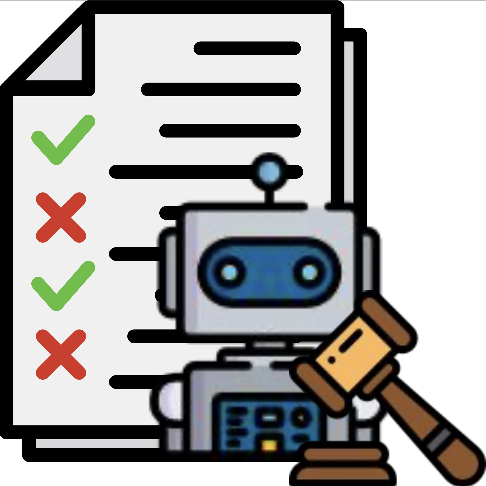
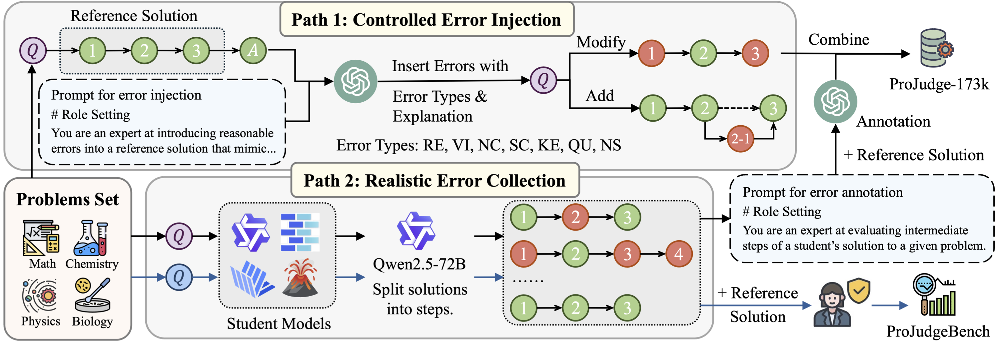

<p align="center">
  <h1 align="center">ProJudge: A Multi-Modal Multi-Discipline Benchmark and Instruction-Tuning Dataset for MLLM-based Process Judges</h1>
    <p align="center">
    <strong>Jiaxin Ai</strong>
    ·
    <strong>Pengfei Zhou</strong>
    ·
    <strong>Zhaopan Xu</strong>
    ·
    <strong>Ming Li</strong>
    ·
    <strong>Fanrui Zhang</strong>
    ·
    <strong>Zizhen Li</strong>
    ·
    <strong>Jianwen Sun</strong>
    ·
    <strong>Yukang Feng</strong>
    ·
    <strong>Baojin Huang</strong>
    ·
    <strong>Zhongyuan Wang</strong>
    ·
    <strong>Kaipeng Zhang</strong>
  </p>
  <p align="center">
  📖<a href="https://arxiv.org/abs/">Paper</a> |🏠<a href="https://github.com/jiaxin-ai/ProJudge">Homepage</a></h3>|🤗<a href="https://huggingface.co/datasets/julyai/ProJudgeBench">ProJudgeBench</a></h3>|🤗<a href="https://huggingface.co/datasets/julyai/ProJudge-173k">ProJudge-173k</a></h3>
  </p>
<div align="center"></div>
<p align="center">
  <p>
As multi-modal large language models (MLLMs) 
frequently exhibit errors when solving scientific problems, evaluating the validity of their reasoning processes is critical for ensuring reliability and uncovering fine-grained model weaknesses. Since human evaluation is laborious and costly, prompting MLLMs as automated process judges has become a common practice.
However, the reliability of these model-based judges remains uncertain.

🌈To address this, we introduce <strong>ProJudgeBench</strong>, the first comprehensive benchmark specifically designed for evaluating abilities of MLLM-based process judges.
ProJudgeBench comprises 2,400 test cases and 50,118 step-level labels, spanning four scientific disciplines with diverse difficulty levels and multi-modal content. 
In ProJudgeBench, each step is meticulously annotated by human experts for correctness, error type, and explanation, enabling a systematic evaluation of judges' capabilities to detect, classify and diagnose errors.
Evaluation on ProJudgeBench reveals a significant performance gap between open-source and proprietary models. 
To bridge this gap, we further propose <strong>ProJudge-173k</strong>, a large-scale instruction-tuning dataset, and a <strong>Dynamic Dual-Phase</strong> fine-tuning strategy that encourages models to explicitly reason through problem-solving before assessing solutions. Both contributions significantly enhance the process evaluation capabilities of open-source models.
We release all the resources to foster future research of reliable multi-modal process evaluation.
  </p>

  <a href="">
    
  </a>
<br>

## 📢 News
- ✨ [03/11/2025] We release our paper and project page.

## 💡 Highlights
- 🔥 **Multi-modal, Multi-discipline, and Multi-difficulty**: Our benchmark comprises 2,400 test cases and 50,118 step-level labels, spanning mathematics, physics, chemistry, and biology, with diverse difficulty levels and multi-modal content.
- 🔥 **Fine-grained Error Analysis**: We define seven error types that encompass common mistakes models may make in long reasoning chains. Each step is meticulously annotated by human experts for correctness, error type, and explanation, enabling a systematic evaluation of process judges' capabilities to detect, classify, and diagnose errors in scientific problem-solving tasks.
- 🔥 **Realistic and Diverse Error Patterns**: To ensure real-world applicability, we collect solutions from 10 distinct MLLMs of varying sizes, architectures, and design goals, reflecting a broad spectrum of realistic reasoning behaviors and error patterns.

Codes and Dataset will be coming soon!

## ✒️Citation
```
@article{ai2025projudge,
  title={ProJudge: A Multi-Modal Multi-Discipline Benchmark and Instruction-Tuning Dataset for MLLM-based Process Judges},
  author={Jiaxin Ai and Pengfei Zhou and Zhaopan Xu and Ming Li and Fanrui Zhang and Zizhen Li and Jianwen Sun and Yukang Feng and Baojin Huang and Zhongyuan Wang and Kaipeng Zhang},
  journal={arXiv preprint arXiv:2503.06553},
  year={2025}
}
```

## 📄 License
  **Usage and License Notices**: The data and code are intended and licensed for research use only.
License: Attribution-NonCommercial 4.0 International It should abide by the policy of OpenAI: https://openai.com/policies/terms-of-use
